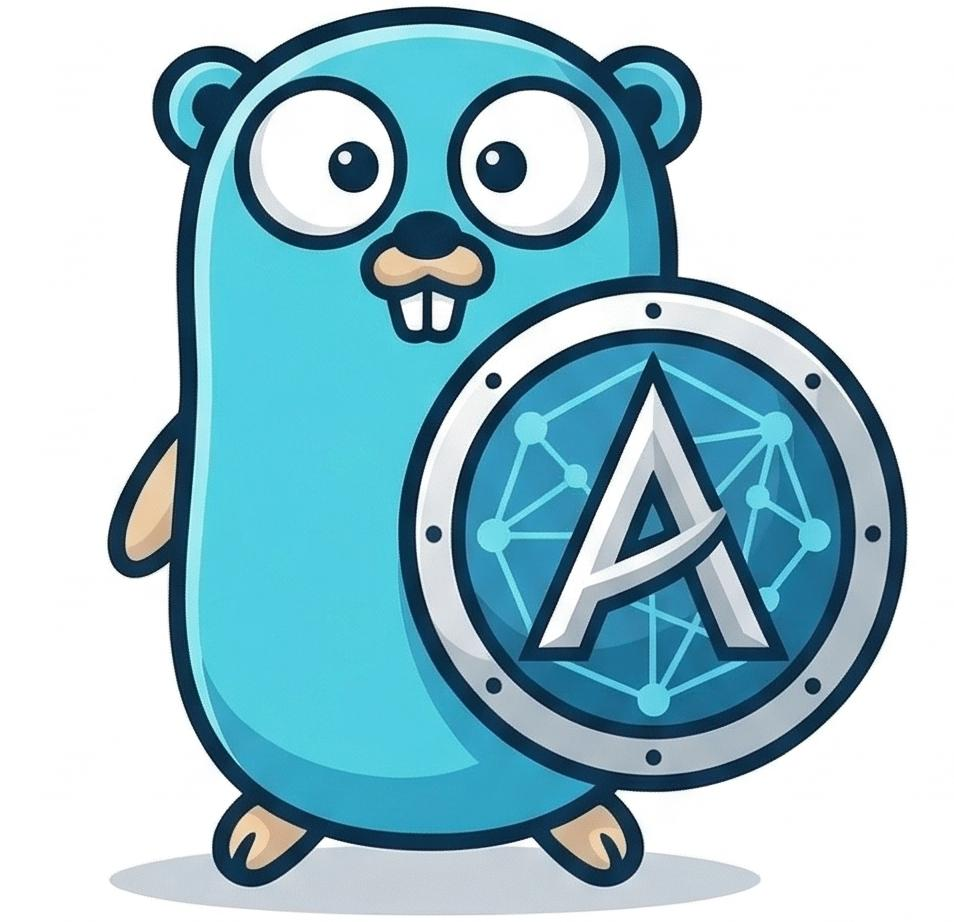

<p align="center">
  
</p>

# aegis-go

[](https://github.com/matstech/aegis-go/releases)
[](https://pkg.go.dev/github.com/matstech/aegis-go/client)
[](https://github.com/matstech/aegis-go/blob/main/LICENSE)

`aegis-go` is a Go SDK for signing outbound HTTP requests accepted by the Aegis proxy.

## Features

- Aegis 2.x compatible canonical string generation
- `XXH64` payload hashing and `HMAC-SHA512` request signing
- `net/http` integration through a reusable `RoundTripper`
- deterministic protocol test vectors aligned with the server implementation

## Install

```bash
go get github.com/matstech/aegis-go/client
```

## Quickstart

```go
signer, err := client.NewSigner(client.Config{
    Kid:    "test",
    Secret: "integration-secret",
    SignedHeaders: []string{
        "Content-Type",
    },
})
if err != nil {
    log.Fatal(err)
}

req, _ := http.NewRequest(http.MethodPost, "http://localhost:8080/anything", strings.NewReader(`{"message":"hello"}`))
req.Header.Set("Content-Type", "application/json")

if err := signer.Sign(req); err != nil {
    log.Fatal(err)
}
```

For transparent signing through `http.Client`:

```go
httpClient := &http.Client{
    Transport: client.NewTransport(nil, client.Config{
        Kid:    "test",
        Secret: "integration-secret",
        SignedHeaders: []string{"Content-Type"},
    }),
}
```

## Development

- `go test ./...`: run unit tests and documentation examples
- `go vet ./...`: run basic static checks
- `AEGIS_RUN_INTEGRATION=1 go test ./test/integration -v`: run Docker-backed end-to-end verification

## Protocol Notes

Aegis signs the string `Auth-CorrelationId[;headerValue...][:xxh64(body)]` with `HMAC-SHA512`, then encodes the signature with standard base64. The body hash format matches the current Aegis server implementation: lowercase hexadecimal `XXH64`.
